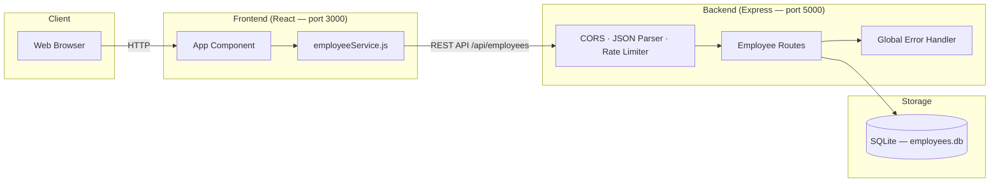
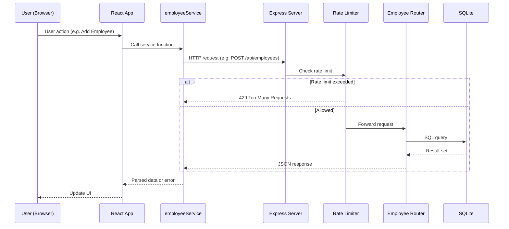
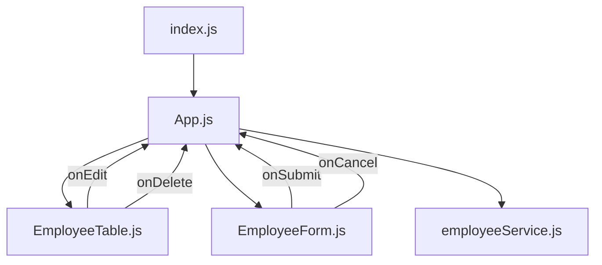
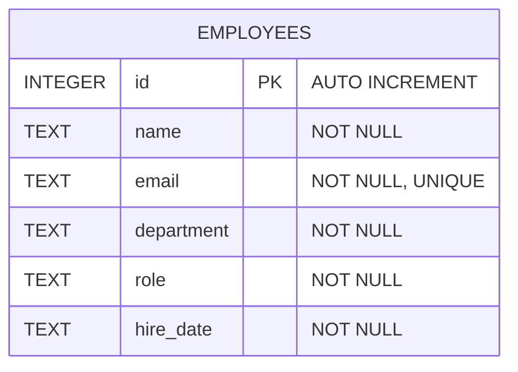
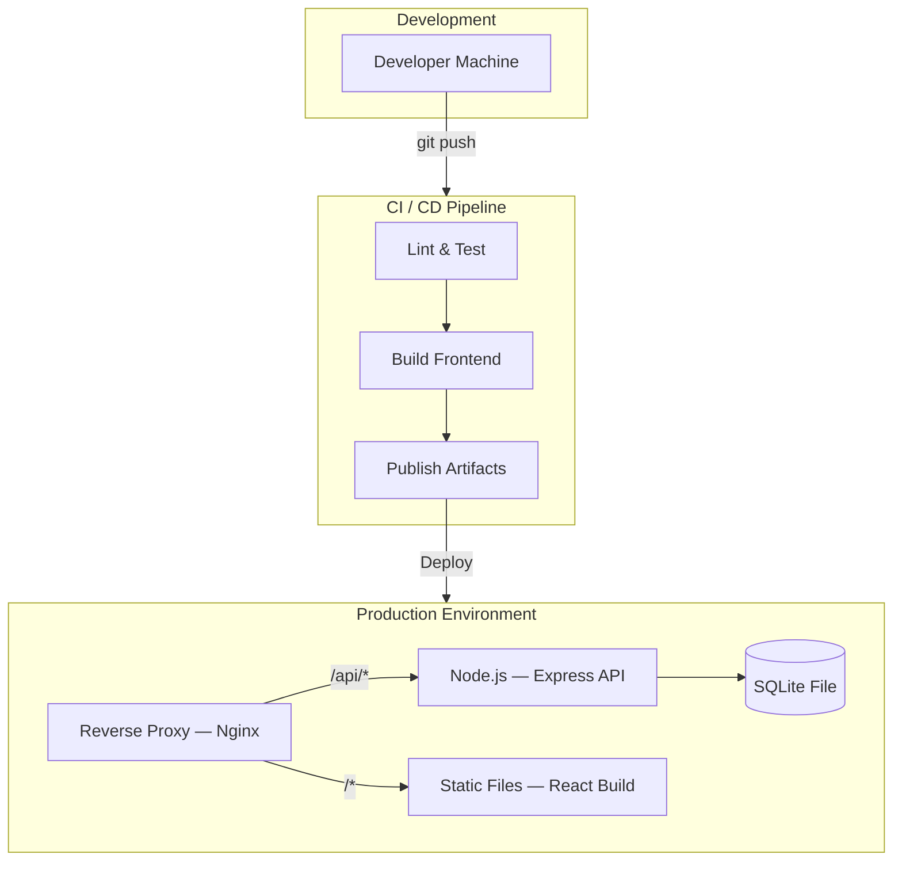
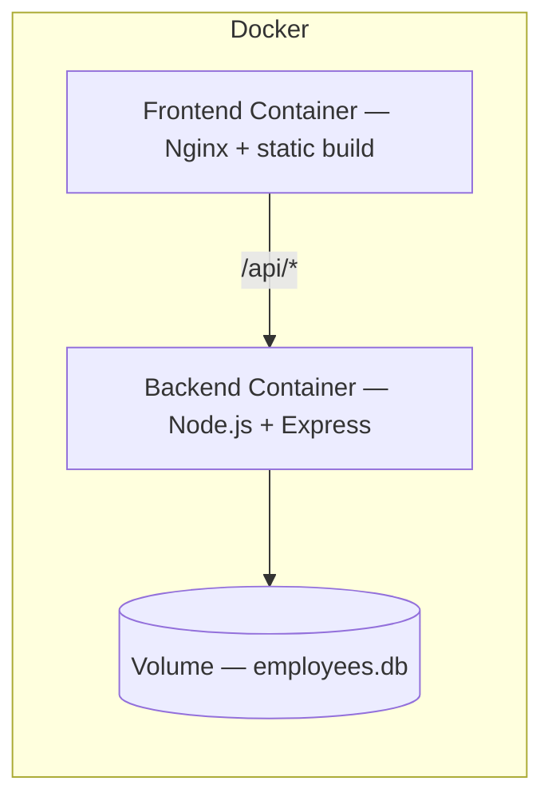

# Employee Management System — Technical Design Document

## Table of Contents

- [1. Problem Statement](#1-problem-statement)
- [2. Proposed Solution](#2-proposed-solution)
- [3. System Architecture](#3-system-architecture)
- [4. Component Breakdown](#4-component-breakdown)
- [5. API Design](#5-api-design)
- [6. Data Model](#6-data-model)
- [7. Security Considerations](#7-security-considerations)
- [8. Performance Requirements](#8-performance-requirements)
- [9. Deployment Strategy](#9-deployment-strategy)
- [10. Trade-offs and Alternatives Considered](#10-trade-offs-and-alternatives-considered)
- [11. Success Metrics](#11-success-metrics)

---

## 1. Problem Statement

Organizations need a centralized system to manage employee records efficiently. Manual tracking via spreadsheets or paper records leads to data inconsistency, duplication, and difficulty filtering or searching for employee information. A web-based application with a clear REST API and an intuitive interface is required to handle Create, Read, Update, and Delete (CRUD) operations on employee records, supporting fields such as name, email, department, role, and hire date.

---

## 2. Proposed Solution

A full-stack web application consisting of:

- A **Node.js/Express REST API** backed by a **SQLite** database for lightweight, file-based persistence.
- A **React single-page application** that communicates with the API to present a responsive employee management interface.
- Built-in **rate limiting**, **input validation**, and **duplicate detection** to ensure data integrity and basic security.

The system is designed as a monorepo with separate `backend/` and `frontend/` directories, each independently installable and runnable.

---

## 3. System Architecture

### 3.1 High-Level Overview



### 3.2 Request Flow



### 3.3 Frontend Component Tree



---

## 4. Component Breakdown

### 4.1 Backend Components

| Component | File | Responsibility |
|---|---|---|
| **Express Server** | `backend/server.js` | Application entry point. Registers middleware (CORS, JSON body parser, rate limiter) and mounts API routes. Exports `app` for testing. |
| **Database Module** | `backend/db.js` | Initializes the SQLite connection via `better-sqlite3`. Creates the `employees` table on first run if it does not exist. |
| **Employee Router** | `backend/routes/employees.js` | Implements all CRUD endpoints under `/api/employees`. Handles input validation, duplicate-email detection, and appropriate HTTP status codes. |
| **Rate Limiter** | Configured in `server.js` | Limits each client to **200 requests per 15-minute window** on all `/api` routes. Returns a `429` status with a JSON error message when exceeded. |
| **Global Error Handler** | Configured in `server.js` | Catches unhandled errors in route handlers and returns a generic `500 Internal Server Error` response. |

### 4.2 Frontend Components

| Component | File | Responsibility |
|---|---|---|
| **App** | `frontend/src/App.js` | Root component managing application state (`employees`, `loading`, `view`, `editingEmployee`, `filterDept`, error states). Orchestrates navigation between list, add, and edit views. |
| **EmployeeTable** | `frontend/src/components/EmployeeTable.js` | Renders a tabular list of employees with Edit and Delete action buttons. Displays an empty-state message when no records exist. |
| **EmployeeForm** | `frontend/src/components/EmployeeForm.js` | Provides a form for creating or editing employee records. Dynamically pre-fills fields when editing. Supports eight predefined departments via a dropdown. |
| **employeeService** | `frontend/src/services/employeeService.js` | Thin HTTP client wrapping `fetch` calls to the backend REST API. Handles response parsing and error propagation. |

---

## 5. API Design

All endpoints are prefixed with `/api/employees` and exchange JSON.

### 5.1 Endpoints

| Method | Path | Description | Success Status | Error Statuses |
|---|---|---|---|---|
| `GET` | `/api/employees` | List all employees (ordered by name). Accepts optional `?department=` query parameter. | `200 OK` | `500` |
| `GET` | `/api/employees/:id` | Retrieve a single employee by ID. | `200 OK` | `404`, `500` |
| `POST` | `/api/employees` | Create a new employee. All fields required. | `201 Created` | `400`, `409`, `500` |
| `PUT` | `/api/employees/:id` | Update an existing employee. All fields required. | `200 OK` | `400`, `404`, `409`, `500` |
| `DELETE` | `/api/employees/:id` | Delete an employee. | `204 No Content` | `404`, `500` |

### 5.2 Request / Response Examples

**Create Employee — `POST /api/employees`**

Request body:
```json
{
  "name": "Alice Smith",
  "email": "alice@example.com",
  "department": "Engineering",
  "role": "Senior Engineer",
  "hire_date": "2022-01-15"
}
```

Success response (`201`):
```json
{
  "id": 1,
  "name": "Alice Smith",
  "email": "alice@example.com",
  "department": "Engineering",
  "role": "Senior Engineer",
  "hire_date": "2022-01-15"
}
```

Error response — missing fields (`400`):
```json
{
  "error": "All fields are required: name, email, department, role, hire_date"
}
```

Error response — duplicate email (`409`):
```json
{
  "error": "An employee with this email already exists"
}
```

### 5.3 Rate Limiting

| Parameter | Value |
|---|---|
| Window | 15 minutes |
| Max Requests | 200 per window |
| Scope | All `/api` routes |
| Headers | Standard (`RateLimit-*`) |
| Exceeded Response | `429` with `{ "error": "Too many requests, please try again later." }` |

---

## 6. Data Model

### 6.1 Entity-Relationship Diagram



### 6.2 Schema Details

| Column | Type | Constraints | Description |
|---|---|---|---|
| `id` | `INTEGER` | `PRIMARY KEY AUTOINCREMENT` | Unique identifier |
| `name` | `TEXT` | `NOT NULL` | Employee full name |
| `email` | `TEXT` | `NOT NULL UNIQUE` | Employee email address (unique) |
| `department` | `TEXT` | `NOT NULL` | Department name |
| `role` | `TEXT` | `NOT NULL` | Job title / role |
| `hire_date` | `TEXT` | `NOT NULL` | Hire date in `YYYY-MM-DD` format |

### 6.3 Supported Departments

The frontend enforces the following department values via a dropdown:

- Engineering
- Marketing
- Sales
- HR
- Finance
- Operations
- Product
- Design

---

## 7. Security Considerations

### 7.1 Current Measures

| Measure | Implementation | Notes |
|---|---|---|
| **Rate Limiting** | `express-rate-limit` — 200 req / 15 min | Mitigates brute-force and denial-of-service attempts on the API. |
| **CORS** | `cors()` middleware with default settings | Allows cross-origin requests. Should be restricted to known origins in production. |
| **Input Validation** | Required-field checks on POST/PUT | Prevents incomplete records from being saved. |
| **Duplicate Detection** | `UNIQUE` constraint on `email` column | Database-level protection against duplicate employee emails. |
| **Parameterized Queries** | `better-sqlite3` prepared statements | Prevents SQL injection via parameter binding. |
| **Error Masking** | Global error handler returns generic `500` message | Avoids leaking stack traces to clients. |

### 7.2 Recommended Improvements

| Area | Recommendation |
|---|---|
| **Authentication** | Add JWT or session-based authentication to protect API endpoints. |
| **Authorization** | Implement role-based access control (e.g., admin vs. read-only). |
| **CORS Restriction** | Restrict allowed origins to the frontend domain in production. |
| **HTTPS** | Serve all traffic over TLS in production environments. |
| **Input Sanitization** | Validate email format, string lengths, and date format on the server. |
| **Helmet** | Add the `helmet` middleware to set secure HTTP headers. |
| **Dependency Auditing** | Run `npm audit` regularly and integrate into CI. |

---

## 8. Performance Requirements

### 8.1 Current Characteristics

| Aspect | Detail |
|---|---|
| **Database** | SQLite — single-file, serverless, zero-configuration. Suitable for low to moderate concurrency. |
| **Query Pattern** | Synchronous prepared statements via `better-sqlite3` — fast for single-user or light multi-user loads. |
| **Frontend Build** | Create React App — production build with minification, code splitting, and static file serving. |
| **Rate Limiting** | 200 requests per 15-minute window caps excessive traffic. |

### 8.2 Targets

| Metric | Target |
|---|---|
| API response time (p95) | < 200 ms |
| Frontend initial load (LCP) | < 2.5 s |
| Concurrent users supported | Up to ~50 (SQLite constraint) |
| Uptime | 99.5 % |

### 8.3 Scaling Recommendations

| Threshold | Action |
|---|---|
| > 50 concurrent users | Migrate from SQLite to PostgreSQL or MySQL for better concurrency. |
| > 500 req/s | Introduce a reverse proxy (e.g., Nginx) and horizontal scaling behind a load balancer. |
| Large datasets | Add database indexes on `department` and `email` columns. Implement pagination on the list endpoint. |

---

## 9. Deployment Strategy

### 9.1 Deployment Diagram



### 9.2 Environments

| Environment | Purpose | Configuration |
|---|---|---|
| **Development** | Local development | Backend on port 5000, frontend dev server on port 3000 with proxy. |
| **Staging** | Pre-production testing | Mirrors production configuration with test data. |
| **Production** | Live application | Frontend served as static build behind a reverse proxy; API behind same proxy with TLS. |

### 9.3 Deployment Steps

1. **Install dependencies** — `npm run install:all`
2. **Run tests** — `npm run test:frontend`
3. **Build frontend** — `npm run build:frontend` (outputs to `frontend/build/`)
4. **Configure environment** — Set `PORT` and any secrets via environment variables.
5. **Start backend** — `npm run start:backend` (or use a process manager such as PM2).
6. **Serve frontend build** — Use Nginx or Express static middleware to serve `frontend/build/`.
7. **Enable HTTPS** — Terminate TLS at the reverse proxy layer.

### 9.4 Containerization (Future)



A `Dockerfile` for each service and a `docker-compose.yml` can simplify multi-service orchestration when the project grows beyond a single-server deployment.

---

## 10. Trade-offs and Alternatives Considered

### 10.1 Database

| Option | Pros | Cons | Decision |
|---|---|---|---|
| **SQLite** (chosen) | Zero-config, file-based, fast for read-heavy workloads, no external service required. | Limited write concurrency, not suitable for distributed deployments. | ✅ Best fit for a small-scale, single-server application. |
| PostgreSQL | Full-featured RDBMS, excellent concurrency, rich ecosystem. | Requires a separate database server, more complex setup. | Recommended when scaling beyond ~50 concurrent users. |
| MongoDB | Flexible schema, good horizontal scaling. | Overkill for a structured, relational data model with a single entity. | Not chosen — relational model is a better fit. |

### 10.2 Backend Framework

| Option | Pros | Cons | Decision |
|---|---|---|---|
| **Express** (chosen) | Minimal, widely adopted, large middleware ecosystem. | Less opinionated — requires manual setup of structure. | ✅ Suitable for a straightforward REST API. |
| Fastify | Higher throughput, built-in schema validation. | Smaller community, steeper learning curve. | Viable alternative for performance-critical workloads. |
| NestJS | Opinionated structure, TypeScript-first, built-in DI. | Heavier framework, longer initial setup for small projects. | Better suited for larger enterprise applications. |

### 10.3 Frontend Framework

| Option | Pros | Cons | Decision |
|---|---|---|---|
| **React (CRA)** (chosen) | Mature ecosystem, component-based, large community. | CRA is in maintenance mode; Vite or Next.js are modern alternatives. | ✅ Good choice for a standard SPA with no SSR requirements. |
| Vue.js | Simpler learning curve, excellent documentation. | Smaller ecosystem than React. | Comparable alternative. |
| Next.js | SSR/SSG, file-based routing, React-based. | Adds server-side complexity unnecessary for this use case. | Consider if SEO or SSR becomes a requirement. |

### 10.4 State Management

| Option | Pros | Cons | Decision |
|---|---|---|---|
| **React useState** (chosen) | Simple, no extra dependencies, sufficient for current scope. | Can become unwieldy with deeply nested state or many components. | ✅ Appropriate for a single-page app with limited state. |
| Redux / Zustand | Centralized state, dev tools, middleware. | Additional complexity and boilerplate for a small app. | Consider if state management requirements grow. |

---

## 11. Success Metrics

| Metric | Target | Measurement Method |
|---|---|---|
| **Functional Coverage** | All CRUD operations work end-to-end | Automated integration tests and manual verification |
| **API Reliability** | < 0.5 % error rate (excl. client errors) | Server-side logging and monitoring |
| **Response Time** | p95 API latency < 200 ms | Application performance monitoring |
| **Frontend Performance** | Lighthouse performance score ≥ 90 | Lighthouse CI in deployment pipeline |
| **Test Coverage** | ≥ 80 % of frontend components covered | Jest coverage reports |
| **Data Integrity** | Zero duplicate emails allowed | Database UNIQUE constraint + automated tests |
| **Availability** | 99.5 % uptime | Uptime monitoring service |
| **User Satisfaction** | Positive feedback from internal users | User surveys and issue tracker activity |
